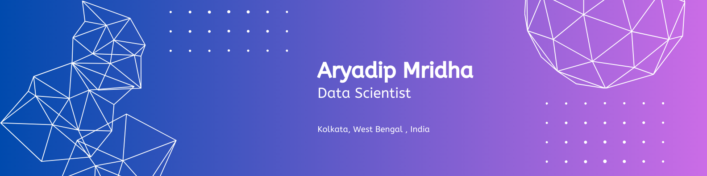

<!-- 
✨ ARYADIP'S FINAL SCI-FI PROFILE
-->

<!-- 1. HEADER BANNER -->

  

<!-- 2. TYPING EFFECT -->

  

<!-- SCI-FI DIVIDER -->

  

 

<!-- 3. ABOUT ME & BRAIN ANIMATION (Fixed Alignment) -->
<table border="0" width="100%">
  <tr>
    <td width="60%" valign="middle">
      <h3>👨‍💻 About Me</h3>
      

        I am an AI Researcher specialized in <b>Generative AI</b>, <b>LLMs</b>, and <b>Agentic Systems</b>. I treat code like art and data like fuel.
      

      <ul>
        <li>🔭 Building <b>Autonomous AI Agents</b>.</li>
        <li>🧠 Fine-tuning <b>Large Language Models</b>.</li>
        <li>⚡ Bridging <b>Deep Learning</b> with <b>Full-Stack</b>.</li>
      </ul>
       
      <!-- SOCIAL BADGES -->
      
      
    </td>
    <td width="40%" align="center" valign="middle">
      <!-- SCI-FI BRAIN GIF -->
      
    </td>
  </tr>
</table>

 

<!-- 4. TECH STACK -->

  <h3>🛠️ Neural Toolkit & Tech Stack</h3>
  
  
<b>🧠 Artificial Intelligence Core</b>

  

    
  

  
<b>🌐 Web Matrix & Data</b>

  

    
  

  
<b>⚙️ Command Center</b>

  

    
  

 

<!-- 5. PROJECTS -->
<h3>🏆 Mission Logs (Featured Projects)</h3>

  
<strong>🚀 Project 1: Autonomous Research Agent</strong>

  <blockquote>
    An AI agent built with LangChain that autonomously browses the web to generate comprehensive research reports.
     
    <b>Stack:</b> Python, LangChain, OpenAI, Tavily
  </blockquote>

  
<strong>🖼️ Project 2: Vision Transformer (ViT) Fine-Tuning</strong>

  <blockquote>
    Custom fine-tuning of ViT models for context-aware image captioning with novel attention mechanisms.
     
    <b>Stack:</b> PyTorch, Hugging Face, Weights & Biases
  </blockquote>

  
<strong>💬 Project 3: RAG-based Support Bot</strong>

  <blockquote>
    Retrieval-Augmented Generation system reducing hallucination by 95% using vector databases.
     
    <b>Stack:</b> TensorFlow, FAISS, LlamaIndex, React
  </blockquote>

 

<!-- 6. GITHUB ANALYTICS (FIXED TABLE LAYOUT) -->
<h3 align="center">📊 GitHub Analytics</h3>

<table width="100%" style="border-collapse: collapse; border: none;">
  <tr>
    <td width="33%" align="center" style="border: none;">
      <!-- General Stats -->
      
    </td>
    <td width="33%" align="center" style="border: none;">
      <!-- Streak Stats -->
      
    </td>
    <td width="33%" align="center" style="border: none;">
      <!-- Top Langs (5 count to keep height reasonable) -->
      
    </td>
  </tr>
</table>

 

<!-- 7. EXTRA COOL STUFF -->

  
  
<b>🏆 Achievements Unlocked</b>

  <!-- Fixed Trophies Link: Removed complex params to ensure it loads -->
  

    

  
<b>📉 Contribution Frequency</b>

  

 

<!-- 8. FOOTER -->

  
    
  

